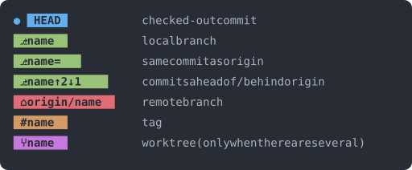

# git-graph

[한국어](README.md) | [English](README.en.md)

<p align="center">
  
</p>

A Claude Code mod that draws your repository's git graph, live, in a side pane next to the terminal.

`/plugin install git-graph@fromshim`

## Features

- One row per commit. Lanes are computed from parent hashes, and each lane keeps its color for its whole life.
- Where several forks meet, link rows of their own keep the lines from running together.
- HEAD is drawn as `●`, every other commit as `┿`, `┯` or `┷`.
- Past 3 lanes the graph folds, and a button unfolds it.
- While you scroll, the top lines (fold, highlight-path and check-remote buttons, uncommitted count, HEAD) stay pinned above a `┊` gap.
- Click a commit hash to open its message and changed files (up to 30).
- In an open card, the `설명` (explain), `리뷰` (review) and `HEAD 와 비교` (compare with HEAD) buttons fill the prompt box. Nothing is sent; edit it, then send.
- Click a file line in the card to insert `@path` at the prompt cursor.
- Commits made through Bash in this session get a `✦` before the subject.
- Click the `커밋 안 한 변경 N개` (uncommitted changes) line to list the changed files (untracked ones show `new`); its `커밋 메시지 정리` (draft a commit message) button fills the prompt box.
- The `경로 강조` (highlight path) button at the top grays out commits that are not ancestors of HEAD. Off by default.
- The `원격 확인` (check remote) button at the top runs `git fetch` every 60 seconds and shows a toast when a branch falls further behind (`↓n`). Off by default.
- Each row ends with an author chip, the short hash and a relative age (`2h`, `3d`, ...).
- Refreshes every 5 seconds and after each Bash tool call.
- `/git-graph` opens and closes the pane.

### Chip legend

<p>
  
</p>

| Chip | Meaning |
| --- | --- |
| `⎇ name` | local branch |
| `⎇ name =` | same commit as origin |
| `⎇ name ↑n ↓n` | commits ahead of / behind origin |
| `⌂ name` | remote branch |
| `# name` | tag |
| `⑂ name` | worktree (shown only when there is more than one) |

## Install

Through the catalog:

```
/plugin marketplace add fromshim/marketplace
/plugin install git-graph@fromshim
```

Or standalone, from this repository:

```
/plugin marketplace add fromshim/git-graph
/plugin install git-graph@git-graph
```

## Requirements and notes

- A Claude Code version that supports hooks-module mods (developed on v2.1.292).
- Mods are behind a remote rollout switch, so they can be off in some environments.
- Colors assume a dark theme (Atom One Dark).
- Only plain Unicode is used; no Nerd Font needed.

## Development

```
claude plugin validate .
claude plugin test .
```

Regenerate the preview: run `npx -y tsx scripts/preview.ts` from the repo root to redraw the SVGs in `assets/` with the `core/` layout.

### Structure

- `core/` is pure TypeScript: no dependencies, no Node or DOM APIs, no JSX, no import of `claude-code`. It takes git output strings and returns data.
  - `ancestry.ts` HEAD ancestry and graying
  - `changes.ts` uncommitted-changes parsing
  - `commands.ts` git argv arrays and the separator
  - `layout.ts` lane layout and folding
  - `mine.ts` commits made in this session
  - `prompt.ts` the texts the buttons put in the prompt box
  - `refs.ts` chips, tracking, worktrees, relative age
  - `remote.ts` detecting a growing behind count
  - `show.ts` `git show` parsing
  - `theme.ts` color palette
- `hooks/register.tsx` is the Claude Code UI only: hooks, pane rendering, refresh and fold wiring, and running git (`$.process.run`).
- The split exists so `core/` can be reused by a future `cli/` (Node) and `app/` (GUI). Neither exists yet; both are planned.

## License

MIT
