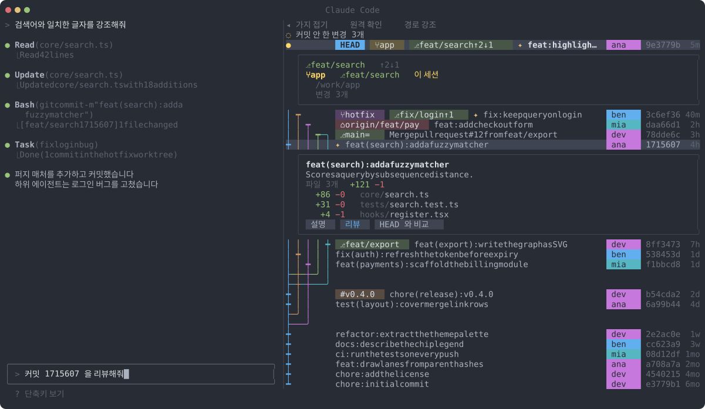

# git-graph

[한국어](README.md) | [English](README.en.md)

<p align="center">
  
</p>

Claude Code 터미널 옆 패널에 저장소의 git 그래프를 실시간으로 그리는 mod 입니다.

`/plugin install git-graph@fromshim`

## Claude 와 함께 쓰기

그래프가 대화 바로 옆에 있어서, 커밋을 눌러 Claude 에게 넘기고 Claude 와 서브에이전트가 만든 커밋을 한눈에 볼 수 있습니다.

<p align="center">
  
</p>

- 커밋 카드의 `설명` `리뷰` `HEAD 와 비교` 버튼을 누르면 입력창에 `커밋 a1b2c3d 을 리뷰해줘` 같은 문장이 채워집니다. 보내지는 않으니 고쳐서 보내면 됩니다.
- 카드의 파일 줄을 누르면 `@경로` 가 입력창 커서 자리에 들어갑니다.
- 이번 세션에서 Claude 가 만든 커밋에는 제목 앞에 `✦` 가 붙습니다. 서브에이전트가 다른 워크트리에서 만든 커밋도 같습니다.
- `커밋 안 한 변경 N개` 줄을 누르면 바뀐 파일이 펼쳐지고, `커밋 메시지 정리` 버튼이 `지금 변경을 커밋 메시지로 정리해줘` 를 입력창에 채웁니다.
- 칩(브랜치·원격·태그·워크트리)을 누르면 그 줄 아래에 로컬 브랜치(origin 과의 상태), 원격 브랜치, 태그, 워크트리(경로, 커밋 안 한 변경 수)가 열립니다. 이 세션의 워크트리는 `이 세션` 과 노란색으로 표시하고, 이 세션의 HEAD 점도 노랗게 빛납니다.
- `원격 확인` 을 켜면 60초마다 `git fetch` 를 돌리고, origin 에 새 커밋이 생기면 토스트로 알립니다.
- `경로 강조` 를 켜면 HEAD 의 조상이 아닌 줄을 회색으로 낮춥니다.

## 기능

- 커밋마다 한 줄. 가지(lane)는 부모 해시로 계산하고, 가지마다 색을 끝까지 유지합니다.
- 가지가 여러 개 갈라지는 지점은 연결 줄을 따로 그려서 선이 겹쳐 읽히지 않게 합니다.
- HEAD 는 `●`, 나머지 커밋은 `┿` `┯` `┷` 로 그립니다. `●` 는 밝은 노랑이고, 터미널에서는 2.4초 주기로 부드럽게 빛납니다.
- 가지가 3개를 넘으면 접어 두고, 버튼으로 모두 펼칩니다.
- 스크롤해도 맨 위 줄(접기·경로 강조·원격 확인 버튼, 커밋 안 한 변경 개수, HEAD)이 `┊` 간격 위에 고정됩니다.
- 커밋 해시를 누르면 메시지와 바뀐 파일 목록(최대 30개)이 열립니다.
- 작성자 칩, 짧은 해시, 상대 시간(`2h`, `3d` 등)을 줄 끝에 보여 줍니다.
- 5초마다, 그리고 Bash 도구를 부를 때마다 새로 읽습니다.
- `/git-graph` 로 패널을 열고 닫습니다.

### 칩 범례

`HEAD` 와 작성자 칩을 뺀 칩은 칩 색을 어둡게 깐 버튼입니다.

<p>
  
</p>

| 칩 | 뜻 |
| --- | --- |
| `⎇ 이름` | 로컬 브랜치 |
| `⎇ 이름 =` | origin 과 같은 커밋 |
| `⎇ 이름 ↑n ↓n` | origin 보다 앞서거나 뒤처진 커밋 수 |
| `⌂ 이름` | 원격 브랜치 |
| `# 이름` | 태그 |
| `⑂ 이름` | 워크트리 (워크트리가 둘 이상일 때만) |
| `⑂ 이름` (노랑) | 이 세션의 워크트리 |
| `⑂ ×N` | 한 커밋에 워크트리가 넷 이상일 때 나머지를 묶은 칩 |

## 설치

Claude Code 가 hooks 모듈 mod 를 켠 빌드여야 합니다 (원격 롤아웃 스위치 뒤에 있습니다). 자세한 건 아래 요구 사항을 보세요.

카탈로그로 설치합니다.

```
/plugin marketplace add fromshim/marketplace
/plugin install git-graph@fromshim
```

이 저장소만 따로 설치할 수도 있습니다.

```
/plugin marketplace add fromshim/git-graph
/plugin install git-graph@git-graph
```

## 요구 사항과 참고

- hooks 모듈 mod 를 지원하는 Claude Code 가 필요합니다 (v2.1.292 에서 개발했습니다).
- mod 기능은 원격 롤아웃 스위치 뒤에 있어서 환경에 따라 꺼져 있을 수 있습니다.
- 패널을 그리다 실패하면 패널에 오류를 보여 주고 토스트로 알립니다. 패널을 열고 5초가 지나도 그리기 요청이 오지 않으면 그것도 토스트로 알립니다.
- 색은 어두운 테마(Atom One Dark)를 기준으로 맞췄습니다.
- 일반 유니코드 문자만 쓰므로 Nerd Font 는 필요 없습니다.

## 개발

```
claude plugin validate .
claude plugin test .
```

미리보기 다시 그리기: `npx -y tsx scripts/preview.ts` 를 저장소 루트에서 실행하면 `assets/` 의 SVG 를 `core/` 레이아웃으로 다시 만듭니다.

### 구조

- `core/` 순수 TypeScript 입니다. 의존성, Node·DOM API, JSX 가 없고 `claude-code` 도 가져오지 않습니다. git 출력 문자열을 받아 데이터를 돌려줍니다.
  - `ancestry.ts` HEAD 조상 계산과 회색 처리
  - `changes.ts` 커밋 안 한 변경 파싱
  - `commands.ts` git 명령 인자와 구분자
  - `layout.ts` 가지 배치와 접기
  - `mine.ts` 이번 세션 커밋 기록
  - `prompt.ts` 버튼이 입력창에 넣는 문구
  - `pulse.ts` HEAD 점의 빛남 프레임
  - `refs.ts` 칩, 추적 상태, 워크트리, 상대 시간
  - `remote.ts` 뒤처진 커밋 증가 감지
  - `show.ts` `git show` 파싱
  - `theme.ts` 색 팔레트와 칩 틴트
- `hooks/register.tsx` Claude Code UI 만 맡습니다. 훅, 패널 그리기, 새로 고침과 접기 연결, 그리고 git 실행(`$.process.run`)이 여기에 있습니다.
- 이렇게 나눈 이유는 `core/` 를 `cli/`(Node)와 `app/`(GUI)에서 다시 쓰기 위해서입니다. 둘 다 아직 만들지 않았고 계획만 있습니다.

## 라이선스

MIT
